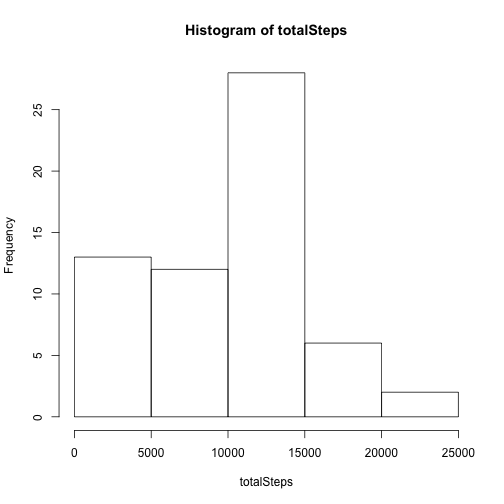
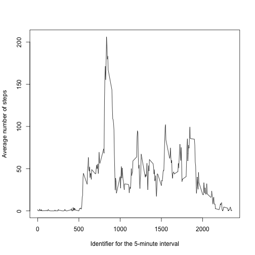
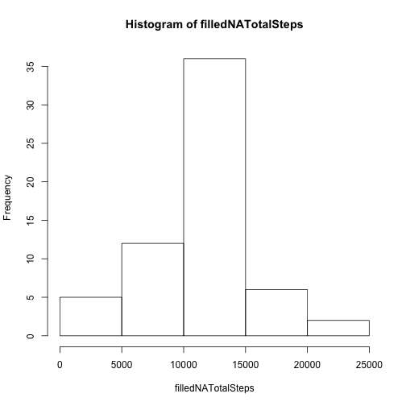
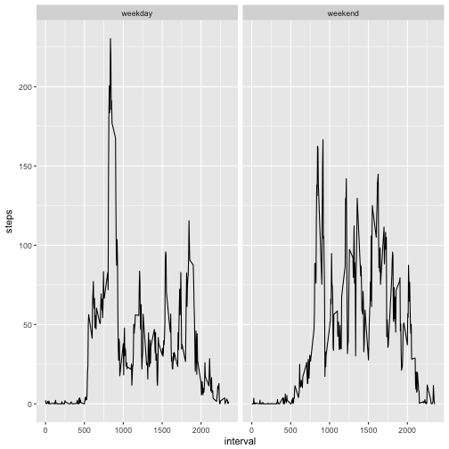

## Loading and preprocessing the data

```r
# Unzip data to a temporary folder
dataTempDir <- tempdir()
unzip("./activity.zip", exdir=dataTempDir)
# Load data
activityData <- read.csv(file.path(dataTempDir, "activity.csv"))
```


## What is mean total number of steps taken per day?

### Calculate total number of steps taken per day

```r
totalSteps <- tapply(activityData$steps, activityData$date, sum, na.rm=TRUE)
```

### Histogram of total number of steps taken per day

```r
hist(totalSteps)
```



### Calculate and report the mean and median of the total number of steps taken per day

```r
mean(totalSteps)
```

```
## [1] 9354.23
```

```r
median(totalSteps)
```

```
## [1] 10395
```


## What is the average daily activity pattern?

```r
# Calculate daily average steps over intervals
avgDailySteps <- tapply(activityData$steps, activityData$interval, mean, na.rm=TRUE)
plot(names(avgDailySteps), avgDailySteps, type="l", xlab="Identifier for the 5-minute interval", ylab="Average number of steps")
```



```r
names(which.max(avgDailySteps))
```

```
## [1] "835"
```


## Imputing missing values
### Calculate and report the total number of missing values in the dataset 

```r
sum(is.na(activityData$steps))
```

```
## [1] 2304
```

### Filling in all of the missing values in the dataset

```r
# Filling missing values using mean for 5-minute inverval
filledActivityData <- transform(activityData, steps = ifelse(is.na(steps), avgDailySteps[as.character(interval)], steps))
```

### Report on the new data set with filled missing values

```r
filledNATotalSteps <- tapply(filledActivityData$steps, filledActivityData$date, sum)
hist(filledNATotalSteps)
```



```r
mean(filledNATotalSteps)
```

```
## [1] 10766.19
```

```r
median(filledNATotalSteps)
```

```
## [1] 10766.19
```

The results are different from the previous report without filling the missing values. Both mean and median values go up.

## Are there differences in activity patterns between weekdays and weekends?

### Create a new factor variable in the dataset with two levels – “weekday” and “weekend”

```r
filledActivityData <- transform(filledActivityData, weekdayWeekend = as.factor(ifelse(weekdays(as.Date(date)) %in% c("Sunday", "Saturday"), "weekend", "weekday")))
```

### Create a time series plot (i.e. 𝚝𝚢𝚙𝚎 = "𝚕") of the 5-minute interval (x-axis) and the average number of steps taken, averaged across all weekday days or weekend days (y-axis).

```r
avgStepsOverDay <- aggregate(steps ~ weekdayWeekend + interval, filledActivityData, mean)
ggplot(avgStepsOverDay, aes(x=interval, y=steps)) + geom_line() + facet_grid(. ~ weekdayWeekend)
```


